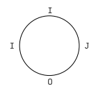
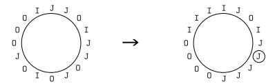

# En-JOI-able Logo Design

- Thời gian: 1s
- Bộ nhớ: 256MB

$K$ thành viên hội đồng bàn bạc việc chọn logo cho Olympic Tin học Nhật Bản (JOI). Sau nhiều ngày phân vân, họ đã chọn một logo gồm các kí tự `J`, `O` và `I` nằm xung quanh một hình tròn. Logo có ý nghĩa rằng bạn sẽ muốn "enjoi" (enjoy) kì thi JOI này!

Chuỗi **JOI** bậc $k$ sẽ được định nghĩa như sau:

- Chuỗi **JOI** bậc $0$ là chuỗi có đúng 1 kí tự `J`, `O` hoặc `I`.
- Chuỗi **JOI** bậc $k + 1$ là chuỗi gồm $4^k$ kí tự `J`, $4^k$ kí tự `O`, $4^k$ kí tự `I` và tiếp theo là một chuỗi **JOI** bậc $k$. Độ dài của chuỗi hiển nhiên là $4^{k + 1}$.
- Ví dụ, `JJJJOOOOIIIIJOIO` là một chuỗi **JOI** bậc 2.

$K$ thành viên hội đồng đang có một xâu độ dài $4^K$ được viết thành vòng tròn. Mỗi kí tự trong xâu là `J`, `O` hoặc `I`. Họ muốn sửa một số kí tự sao cho xâu là một chuỗi **JOI** bậc $K$ nếu đọc theo thứ tự đúng chiều kim đồng hồ từ một vị trí nào đó. Vì thời gian có hạn nên họ muốn sửa ít vị trí nhất có thể.

## Yêu cầu

Bạn được cho một xâu độ dài $4^K$ được viết trên vòng tròn. Hãy viết chương trình tìm số lượng kí tự ít nhất cần phải sửa để thỏa mãn: tồn tại một cách đọc xâu, xuất phát từ một vị trí nào đó trên vòng tròn và đi theo chiều kim đồng hồ, mà xâu là một chuỗi **JOI** bậc $K$.

## Dữ liệu nhập vào

Hãy đọc từ standard input dữ liệu theo định dạng sau:

- Dòng thứ nhất gồm một số duy nhất $K$. Độ dài xâu được cho sẽ là $4^K$.
- Dòng tiếp theo gồm một xâu $S$ có độ dài $4^K$ chỉ gồm các kí tự `J`, `O` và `I`. Đây là xâu bạn cần xử lý.

## Dữ liệu in ra

Hãy in ra trên 1 dòng duy nhất số lượng kí tự tối thiểu mà $K$ thành viên hội đồng cần phải sửa.

## Giới hạn

Trong tất cả các test:

- $1 \le K \le 10$

## Subtask
### Subtask 1 (30 điểm)

Các test sẽ có thêm giới hạn sau:

- $1 \le K \le 5$

### Subtask 2 (70 điểm)

Không có giới hạn gì thêm.

## Ví dụ
### Input 1
```
1
IJOI
```
### Output 1
```
0
```
Các kí tự được biểu diễn như hình sau:



Ta thấy nếu đọc từ kí tự `J` ta có xâu `JOII` là một chuỗi **JOI** bậc 1, thỏa mãn đề bài. Vì thế ta không cần sửa kí tự nào.

### Input 2
```
2
JJOIJJOJOIOJOOOI
```

### Output 2
```
7
```
Ta có cách sửa tối ưu sau (phần đánh vòng tròn là kí tự đọc bắt đầu):

